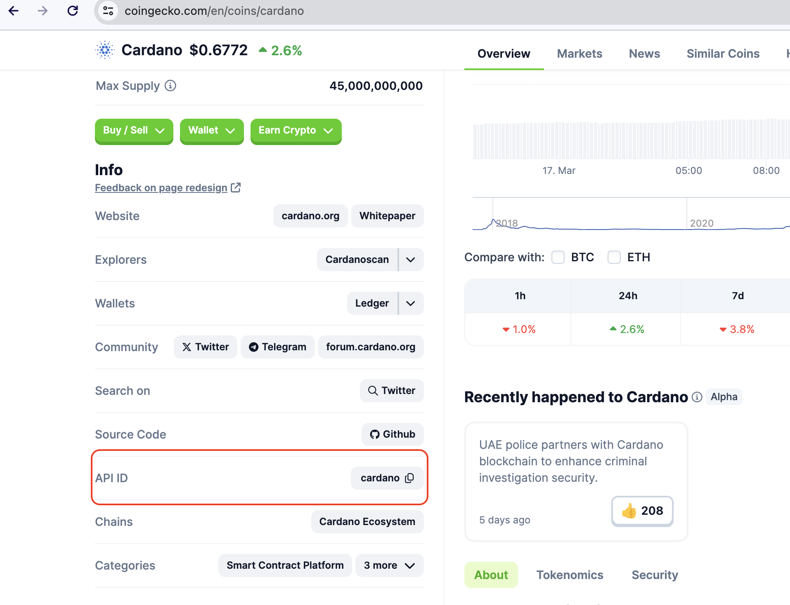
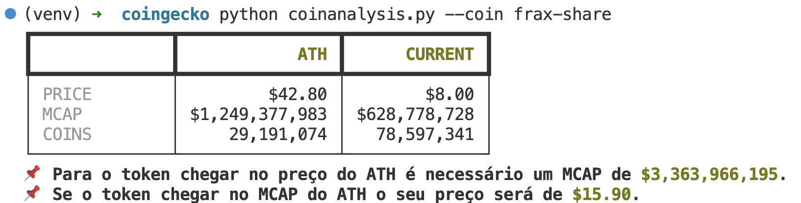

# Coin Analysis

## Pre requisitos

- Ter o python instalado
- Ter o virtualenv instalado

## Instalação

Após os requisitos completos, execute os comandos abaixo

```sh
git clone git@github.com:phplucas/crypto-helper.git
cd crypto-helper/coin-analysis
virtualenv venv -p python3.9
source venv/bin/activate
pip install -r requirements.txt
```

## Execução

Para executar o script rode o comando abaixo, onde {TOKEN} é o token-id que voce desejar analisar.

```sh
python coinanalysis.py --coin {TOKEN}
```

Nota:
- Para obter o token-id que desejar analisar, acesse o coingecko e utilize o valor do campo API ID, como no exemplo abaixo:



## Prints

### FXS

